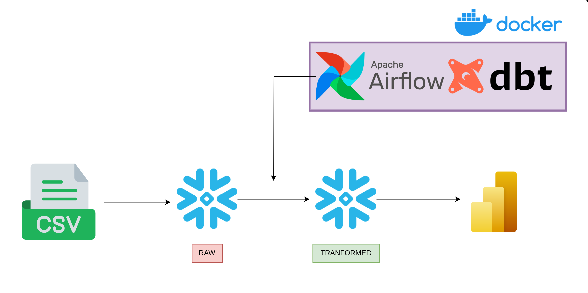
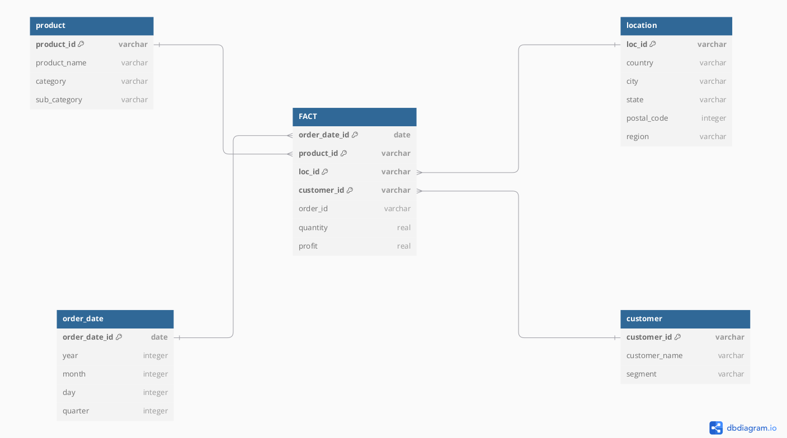
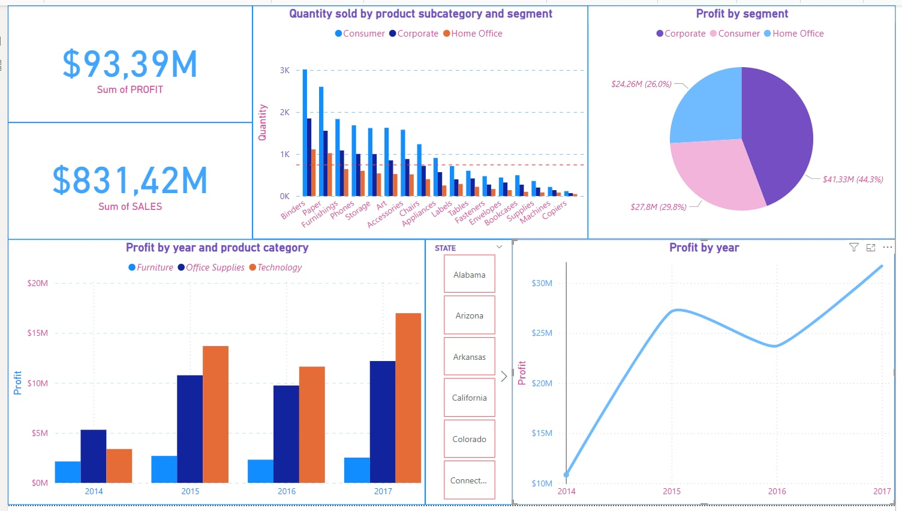

## About the project 
This Data Pipeline tackles a retail sales problem and it's goal is to give a clear vision on the Dataset and to answer business questions through using Data Engineering techniques such as Dimensional Modeling, ELT, Visualisations... 

Data Warehouse: **Snowflake** <br>
Data Transformation: **DBT** <br>
Workflow Orchestration: **Apache Airflow** <br> 
Containerization: **Docker** <br>
Visualization: **Power BI** <br>



The first step that i took, is building the star schema using an ER Diagram building tool called DBDiagram. <br>
Creating these kind of models help us in later transformations.  



## Executing the project

### 1 Setup Snowflake 
The first step is to create a Snowflake if you don't have one, after creating it copy this script into a new worksheet

```sql
USE ROLE ACCOUNTADMIN; 

CREATE WAREHOUSE WH_NAME WAREHOUSE_SIZE = 'xsmall'; 
CREATE DATABASE IF NOT EXISTS DB_NAME; 
 
CREATE ROLE IF NOT EXISTS ROLE_NAME; 
GRANT USAGE ON WAREHOUSE WH_NAME TO ROLE ROLE_NAME;

GRANT ALL ON DATABASE DB_NAME TO ROLE ROLE_NAME; 

GRANT ROLE ROLE_NAME TO USER USER_NAME;
USE ROLE ROLE_NAME; 

CREATE SCHEMA DB_NAME.SCHEMA_NAME; 
```
### 2 Deploy Containers 
```bash
cd /projectDir

docker pull apache/airflow
docker compose up airflow-init
docker-compose up -d --build 
```
### 3 configure the dbt project 
Write Snowflake credentials to profiles.yml.
If you want to make some changes in the projects like schemas that you want to write to or materialization, this can be done through dbt_project.yml

### 4 Trigger Airflow DAG
Head to localhost:8080, look for our DAG(dbt_dag) in the Airflow UI and trigger it. This will trigger three tasks, our dataset will be written to a Snowflake schema with the name RAW_DATA, after that Data is transformed into dimensions and fact table, and the last task will test our models(test can be generic or singular, generic tests are defined in schema.yml and singular are defined as SQL quries under test/). 

To get the job done without Airflow: 
```bash
cd projectDir/sales_dbt

dbt seed
dbt run
dbt test
```
## Dashboard
This is the dashboard i built after refining Data and creating the models 



## Ressources
Here are some ressources that helped me: <br>
- DBT official documentation
- [Orchestrating dbt on Snowflake using Apache Airflow: A Comprehensive Guide](https://medium.com/@aminesnoussi7/orchestrating-dbt-on-snowflake-using-apache-airflow-a-comprehensive-guide-9ca100eb6391)


